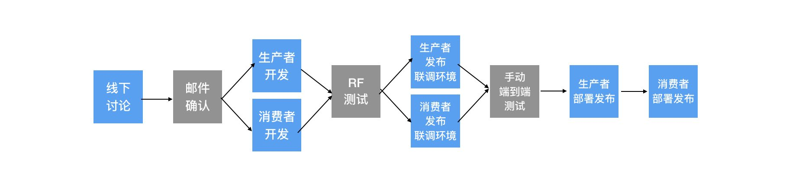

# ThanosContract 灭霸契约

## Vision 愿景

ThanosContract is target to help the systems which still using TCP & Fix-length message to implement Contract Test. 灭霸契约旨在为还在使用TCP+定长报文的系统提供契约测试工具，核心功能包括：

* Provide MockServer for consumer: 为消费者提供挡板服务
* Provider Junit Test Sample for provider: 为生产者提供自动化测试案例

### Background 背景
在内外部系统依赖关系比较复杂的场景下，常会遇到：
* 并行开发困难，经常需要等待联调测试，往往到端到端测试阶段才发现问题。因为发现问题的时机太晚，重复翻修导致效率低。
* 因为端到端测试经常发现问题，于是添加的大量端到端测试集合，从测试的编写、维护到准备大量的测试数据，投入非常大，然而后续运行不稳定，需要大量人工介入。

### Taget 目标流程

契约测试让生产者与消费者之间能基于契约而更高效也更高质量地并行开发，减少端到端联调的压力。在依赖关系复杂的系统间尤为重要。它目标是在开发初期就协定契约，并在整个开发测试过程中以同一份契约规约双方，测试驱动从而保证质量，减轻端到端的压力。

### Difference 差异化
Different from **SpringCloudContract** & **Pact**, ThanosContract support(& only support) TCP + fix-length messaging.

现有成熟的契约测试框架SpringCloudContract和Pact提供了基于HTTP+JSON格式的契约测试框架，但现实仍有不少的系统（如银行核心系统）依然徘徊在TCP+定长报文的场景之中，无法使用契约测试的概念去提高质量和减轻对端到端测试的压力。而灭霸契约则提供了TCP+定长报文的契约测试支持。

## Core Components 核心组件

### MockServer 挡板服务
* STANDALONE模式：能根据路径内的契约文件自动生成对应的挡板服务
* PLATFORM模式：能从ContractService中获取最新契约及更新，动态维护挡板服务

### CodeGenerator 代码生成引擎
* STANDALONE模式：根据指定路径的契约文件自动生成对应的生产者测试案例，可按需复制黏贴到项目工程代码中。
* PLUGIN模式(?)：插件根据生产者项目工程路径内的契约文件自动生成对应的生产者测试案例，可直接修改运行。
* PLATFORM模式：能从ContractService中获取最新契约及更新，动态生成对应的生产者测试案例

### PLATFORM mode draft diagram 设计草图

## License
ThanosContract is under [MIT](LICENSE) license

